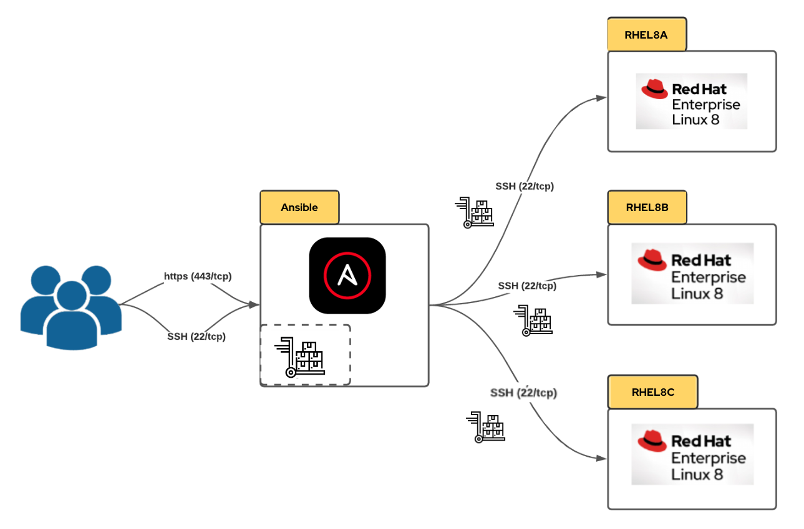
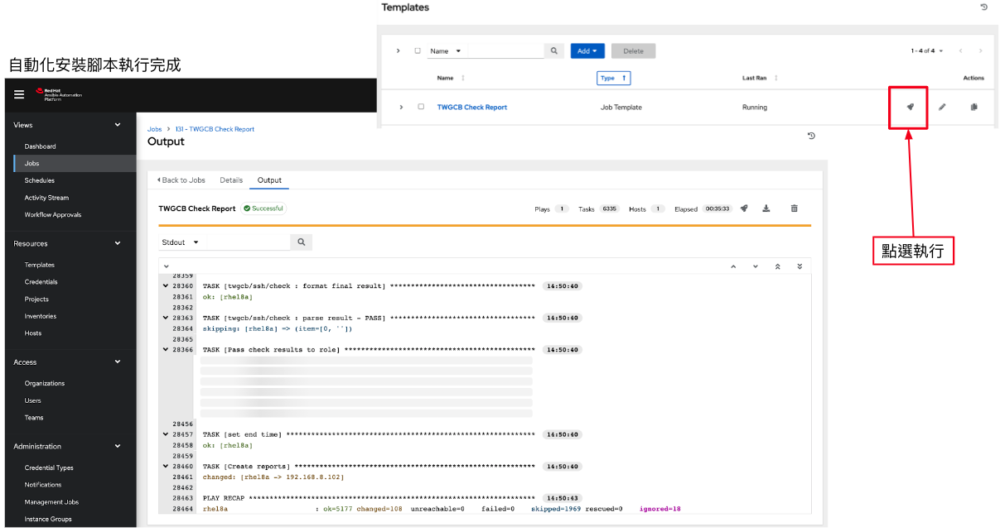
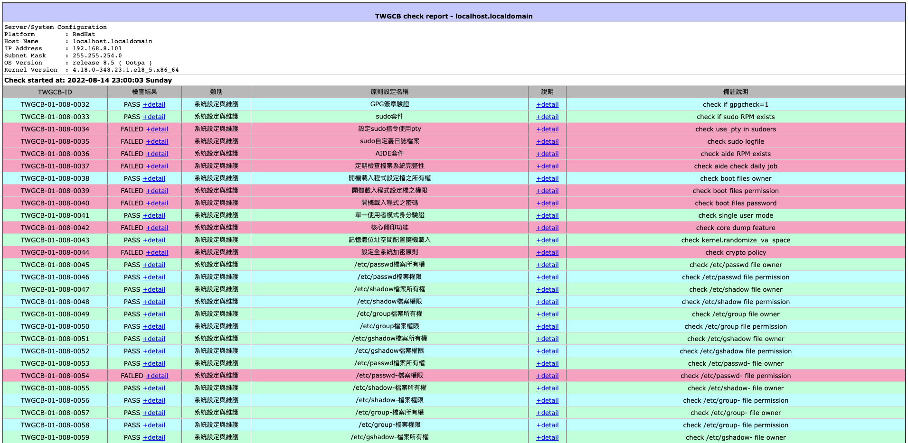
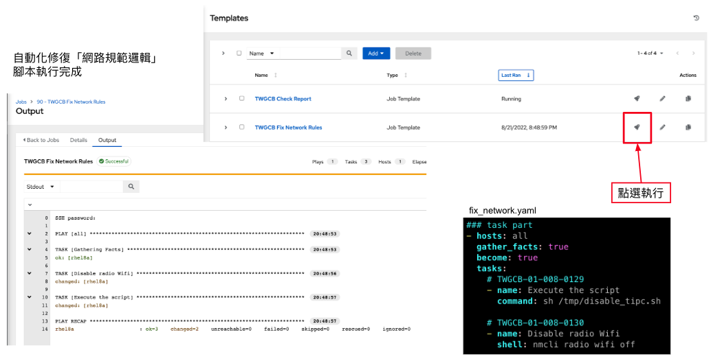

# 2. 透過自動化進行 TWGCB 臺灣政府組態標準合規 - 邏輯檢查

## 任務流程

```
- 階段 1 : 盤點稽核主機節點 > 邏輯檢查(TWGCB) > 產出主機對應報表
- 階段 2 : 評估環境規範狀態 > 修正環境符合規範 > 重新產出報表 > 比對報表狀態已修復
```

作業系統安全是企業資安的最後也是最基本的防線，在企業導入眾多前端防護與強化系統後，政府資安稽核開始要求 IT 強化基礎架構的安全性。本文章將介紹如何將原有基礎設施環境及各孤島系統，透過客製化腳本快速整合定義，並從「行政院發布-TWGCB-組態管理標準化」條例進行邏輯檢查，挑選能符合企業文化與需求的規範，我們可透過自動化工具 Ansible 降低維運成本及檢查效率，並建立例行作業使自動化管理企業環境及未來多元應用。

## / 概述 /

TWGCB 由行政院國家資通安全會報技術服務中心發佈，政府組態基準(Government Configuration Baseline，簡稱GCB)目的在於規範資通訊設備 (例如：個人電腦、伺服器主機及網通設備等) 的一致性安全設定 (例如：密碼長度、更新期限等)，以降低成為駭客入侵管道，進而引發資安事件之風險。(擷取資料: [行政院國家資通安全會報技術服務中心](https://www.nccst.nat.gov.tw/GCB))。

### TWGCB 發展與目的

政府主要目的期望藉由提供電腦作業環境一致性資安防護基準與實作指引，供政府機關及企業能透過建立安全組態，提升資安防護能力。

本文以提供 `TWGCB for Red Hat Enterprise Linux 8` 作業系統為例，GCB 主要規範機關內作業系統有一致性安全設定，以降低成為駭客入侵管道，進而引發資安事件之風險：

1. 發展一致性安全組態設定
2. 提升作業系統使用安全性

共計 292 項規定，分基本項目(243項)，防火牆(18項)以及SSH服務(31項)
  - 主要參考下列二項國際知名資訊安全標準：
      - CIS (Center for Internet Security) RHEL 8 Benchmark
      - DISA(Defense Information Systems Agency) RHEL 8 STIG 以及 TWGCB for RHEL 5 相關內容
      

> 擷取至 [TWGCB-01-008(v1.0)-政府組態基準說明文件](https://download.nccst.nat.gov.tw/attachfilegcb/TWGCB-01-008_Red%20Hat%20Enterprise%20Linux%208%E6%94%BF%E5%BA%9C%E7%B5%84%E6%85%8B%E5%9F%BA%E6%BA%96%E8%AA%AA%E6%98%8E%E6%96%87%E4%BB%B6v1.0_1100924.pdf)


## / 引入前思考 /

各企業為確保有所本能符合政府合規檢核基準，企業資安維運團隊的將要思考，如何採用規範及當前大量基礎設施，包含三大面向：

1. 如何定義系統組態合規標準條例(不影響企業服務) 
2. 大範圍檢查及修正的人力成本？ 
3. 人工製作的系統組態稽核報告？

當前市面上有很多針對 TWGCB 的一些合規 Solution 和產品，但要符合因應企業內部不停需求及`客製化`的方面相對比較困難，而企業能做什麼：
- 需要找一個專家顧問團隊(如 Red Hat Consultant 團隊)，可針對企業環境與既有資安團隊定義的規範重新評估，進行訪談企業內所它需要的一個自動化對應腳本及如何引入 TWGCB 合規機制。
- 列舉針對企業不同作業系統做規範定義 (e.g RHEL8)[補充]，顧問團隊在這些規則裡面去取用企業資安團隊能夠接受的相關條例。
- 將這些規則列舉並透過後續自動化方式建立，達到 IT 維運團隊能夠透過一連串自動化部署及邏輯檢查，以更加速日常合規檢核及後續對應報表需求的最終目的。


> 補充: 其他作業系統，若要評估資安條例及防範規範檢查，可以參考[實現 OpenSCAP 自動化邏輯檢查](https://blog.yylin.io/ansible/openscap/) 文章介紹的 OpenSCAP 工具。


## / 透過 Ansible 結合 TWGCB 實現系統「自動化」合規檢查 /

上述文中釐清企業狀態與需求，這邊列出當前引入 TWGCB 政府組態規範目標：
- 提供一套自動檢測
- 能夠定時執行
- 確認合規的完整報表(各項合規細節說明)

在以下展示中我們透過影片方式，介紹如何透過 AAP 與 客製化 TWGCB腳本來達成自動合規「邏輯檢查」報表產出：

- AAP 自動化工具 

Red Hat Ansible Automation(簡稱 AAP) 可以協助維運團使 IT 環境和流程的各個方面實現自動化，而 AAP 則可以與其他服務整合。自動化工具架構如下圖，我們會有一台 Ansible Controller，它是一個中控平台中心，我們管理對象包含我們企業內部 On-Premise 各環境作業系統節點。 

- 定義客製化腳本 | 整合 TWGCB 組態檢查

自動化工具需要透過腳本運行，顧問團隊透過訪談及列舉需求，開發出企業客戶所需的專業腳本，企業維運人員透過 UI 介面方便管理者後續操作及工作流程串接，運行後續提供「結果報告」，協助企業釐清當前環境依據 TWGCB Profile 是否符合對應規範及條例，讓企業有檢驗後依據，並能將此報告交由企業內部資安團隊進行後續修正依據。



### 展示 - 產出 RHEL 8 主機組態設定檢查報表


- 作業目的：
自動至 RHEL8 主機進行 TWGCB 檢查項目，結果整合於 HTML 報表中呈現。

- 檢查項目：
腳本以 TWGCB 說明文件項目規範， 針對主機「檢查邏輯」結果


首先，配置 TWGCB Check Report 於 Ansible Automation Platform 環境，一鍵點選執行就會進行節點 TWGCB 邏輯檢查



運行後，產出報表呈現包括：
  - 查詢主機狀態 / 時間 / 系統版本 資訊
  - TWGCB - ID / 檢查結果 
  - 依據組態基準項目進行 「類別」分類
  - 檔案行首的「+」符號 => 可以確認結果狀態與資訊



### 展示<1>- 透過 Ansible 結合 TWGCB 實現系統自動化合規檢查並產出報表
> 實際展示影片 (請打開`字幕`)

[](https://www.youtube.com/watch?v=XPlo67IBtQw "展示 - 透過 Ansible 結合 TWGCB 實現系統自動化合規檢查並產出報表")


### 補充展示 - 運行修復 RHEL 主機設備規則並比對先前報表結果

> 邏輯檢查修復部分，需要經過企業內部資安團隊與當前服務不衝突情況下評估，並藉由專業顧問團隊同時釐清需求，才會進行大量修復情境，以下展示以「網路設定」條例做修復展示。

- 作業目的：
自動至 RHEL8 主機進行 TWGCB 檢查，類型「網路設定」項目，結果進行修復。

- 檢查項目：
針對邏輯檢測主機，結果「TIPC協定、無線網路介面」資訊，進行自動化腳本關閉修復。

首先配置針對 `TWGCB-01-008-0129` 及 `TWGCB-01-008-0130` 條例撰寫對應修復 Task，並且透過 AAP 一鍵運行修復：



重新運行 `TWGCB Check Report` 後比對邏輯檢查結果，發現條例內容已經做修復，並顯示 PASS 資訊：


> 實際展示影片 (請打開`字幕`)

### 展示<2> - 透過 Ansible 執行修復 TWGCB 邏輯檢查配置並重新執行檢查產生報表
[](https://www.youtube.com/watch?v=qTY95XwzhzQ "展示 - 透過 Ansible 執行修復 TWGCB 邏輯檢查配置並重新執行檢查產生報表")

## / 結論 /

我們可以透過台灣 GCB 組態基準進行邏輯檢查，透過 Ansible 客製化 Playbook 腳本提供大量主機節點，對企業客戶來說條例檢查過程 Output log 資訊很重要，Red Hat 專業顧問團隊將企業需求的客製化報表提供客戶，有完整可視化條例資訊查看，更能幫助企業資安團隊，確認當前環境使用的套件及安裝組態做清查及彙整，並透過每次運行報告清單中變化，來查閱這些變化是不是符合流程申請，以企業客戶需求導向給一個範本出來，讓客戶有一個基本的概念與依據組態管理自動化檢驗擁有完整報告，如此將可大幅降低資安風險，即可延伸探討後續修正及相對應資安防範措施。


## Reference 
- https://www.mss.com.tw/gcb.html

